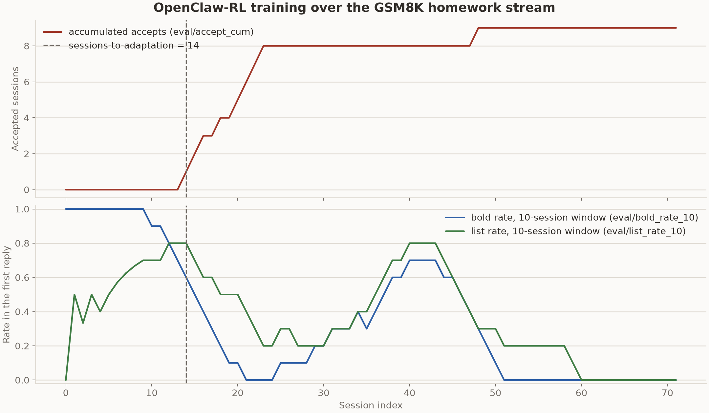

# OpenClaw-RL on Apple Silicon — Qwen3.5-9B, MLX (all 32 layers)

The GSM8K homework stream, trained on a single Mac. The policy both serves and
trains in one process on the [MLX backend](../../../../../../reef/train/mlx_backend);
the two roles that only ever need text — the PRM's accept/reject votes and the
student's reactions — go to a hosted GLM-5.3 over an OpenAI-compatible endpoint.
Unlike the [27B run](../2026-09-07-gsm8k-stream-qwen3-27b-mlx), which could only
reach two layers, this trains **all 32 layers** of Qwen3.5-9B at rank 64.

**It learns.** The stream reaches the benchmark's own adaptation metric at
**session 14** — earlier than the 27B's 21, matching the 4B/7×GPU reference's 14.

## The point of this run: it survives a full stream

The 27B run learned but was fragile to drive. This run's contribution is that the
serving/training loop no longer OOMs over a long stream, and finding out why it
did took discarding a wrong theory. A recurring `[METAL] Insufficient Memory`
read for days like a per-training-version leak in the service path. It was not.
A `tracemalloc` pass on the live serve showed the retained-object set flat and
the OOM firing in **generation**, not the training backward:

```
pump_rollouts → BatchGenerator.next_generated → cache.filter
  → RuntimeError [METAL] Insufficient Memory
  → [concatenate] ... (14,3,8192) vs (4,495,8192), axis 1
```

That `concatenate` is the tell: a GatedDeltaNet **conv-state** (sequence length
≈ the conv kernel) being spliced onto an attention **KV** (sequence length in the
hundreds). **mlx-lm's continuous `BatchGenerator` cannot merge the Qwen3.5 hybrid
cache** when a fresh prompt joins a live decode batch — the mixed
GatedDeltaNet/attention per-layer caches concatenate on mismatched shapes and the
decode Metal-OOMs. It explains every earlier observation: concurrency 1 always
survived longest (it never splices), 2 and 4 died soonest, and the isolated
single-sequence engine tests were always flat because they never exercised a
multi-sequence insert/filter.

The fix landed in two steps. First, static batching in the engine
(`ContinuousBatcher._insert_queued` refuses to splice into a live batch). Then,
since mlx-lm can't continuously batch this model and static batching serialised
whole windows anyway — buying ~no throughput — the serving backend was changed to
drive the engine as a **single sequence** (`engine.generate`) under the engine
lock, the same way the streamed path already did. Concurrent requests serialise
through the lock; each still captures its own top-k, so the trainable record is
unchanged. This run used that single-sequence path.

**Result: 72 sessions, 75 training versions, zero OOM, zero cache errors**, serve
up throughout.

## How it was run

A **Mac-native driver standing in for Hermes**, aligned to the reference
harness's session semantics — the same `problem.json` files, the unmodified
`StudentSession` judge and acceptance criterion, `MAX_TURNS = 8`, a dead turn
recorded as a `failure` rather than scored. The driver ran two sessions
concurrently against the host-native Reef+MLX service (port 8904); the PRM votes
and student reactions went to GLM-5.3. The one behavioural difference from Hermes
is tool-call plumbing (this driver parsed calls from the reply text); the training
tokens and log-probs are captured from the raw stream before any presentation
split, so this bears on the agent loop and the judged prose, not the gradient.

## Result

| metric | this run (MLX, 9B) | 27B run (MLX) | reference (4B, 7×GPU) |
|---|---|---|---|
| `sessions_to_adaptation` | **14** | 21 | 14 |
| trainable layers | **all 32** | 2 of 64 | full-parameter |
| trainable parameters | 135M (LoRA, r64, 32 layers) | 45M (r256, 2 layers) | full 4B |
| OOM over the stream | **0** (72 sessions) | — | — |
| hardware | 1× Apple Silicon, 48 GB | 1× Apple Silicon, 48 GB | 7× GPU |

`sessions_to_adaptation` is the first of three consecutive accepted sessions,
computed by the recipe's own [`learning_curve.py`](../learning_curve.py) from the
verdicts on disk. Accepts landed at **s14, s15, s16** (the adaptation window),
s18, then a four-in-a-row peak at **s20–s23**, a lone s48, and none after — nine
accepts in seventy-two sessions.



## What collapses (and what does not)

Accepts stop after s23, but the policy did not un-learn. The failure mode of the
*rejected* sessions changes completely at adaptation, and the change is the whole
story — measured from this run's own verdicts (`curve.csv`):

| phase | rejected sessions | reject reason: style violation | reject reason: no reply (tool loop) |
|---|---|---|---|
| pre-adapt (s0–13) | 14 | **14** | 0 |
| post-adapt (s14–71) | 49 | 17 | **32** |

Before adaptation the model *answers*, just with the markdown the criterion
penalises (bold, bullets, lists) — every one of the fourteen early rejects is a
style violation on a healthy 450–1400-character reply. The adaptation window is
the model learning to drop the markdown. **After adaptation the rejects flip to
"no reply":** the agent enters a tool loop — reading and rewriting its file
without ever emitting a final answer — and the session times out with an empty
first reply (s51–s71 is an unbroken run of these). The lone s48 accept lands
*eight turns deep*, which shows the answer is still in there when the loop lets it
out.

This is the same degeneration the 27B run documented: what breaks is the **save
turn of the agent loop, not the answer**. The objective (OPD + RL) pushes the
trainable weights past where they still generalise on the multi-turn loop, and the
verifier — which grades only the first reply — scores an automatic reject when
there is no first reply at all. The open item is stabilising the tail: a lower
learning rate or a stronger KL past the adaptation point. (The 27B run's held-out
control, which separated the *answer* quality of trained vs. base checkpoints,
was not repeated for this config — this record measures the stream, not a control.)

## Memory

Single-sequence serving removed the batched KV, dropping the idle/wired footprint,
but the training **backward** peak is inherent to a 9B on a long transcript and is
unchanged by how serving batches. Each training version's backward briefly took
free memory down to ~100–800 MB and recovered every time; swap stayed near zero,
and no version OOM'd across the full run. `max_tokens: 2048` was the run's setting;
`1536` is the lever if a longer transcript ever tips a backward over.

## Configuration

See [`serve.yaml`](serve.yaml). The load-bearing choices: `lora_layers: 32`
(the whole 9B), `lora_rank: 64`, `log_probs_chunk_size: 512` (so the head's
backward cost is set by the chunk, not the response length), `kl_coef: 0.05`
(frozen-base KL, holds the untargeted mass), `batch_size: 8`, `temperature: 0.6`.
The judge is a hosted model (`prm_model: z-ai/glm-5.3`), so the deployment serves
only the policy. The API key is read from `$OPENROUTER_API_KEY`; the config
records only the variable name.

## Files

- `learning_curve.png`, `curve.csv` — the run, from [`learning_curve.py`](../learning_curve.py).
- `serve.yaml` — the deployment (policy on MLX, judge + student on GLM-5.3).
- [runtime notes](../2026-09-07-gsm8k-stream-qwen3-27b-mlx/mlx-runtime-notes.md) —
  runtime-general operational notes shared with the 27B run: topology, reading a
  step's training metrics, the adapter artifact format, and the capacity envelope.
